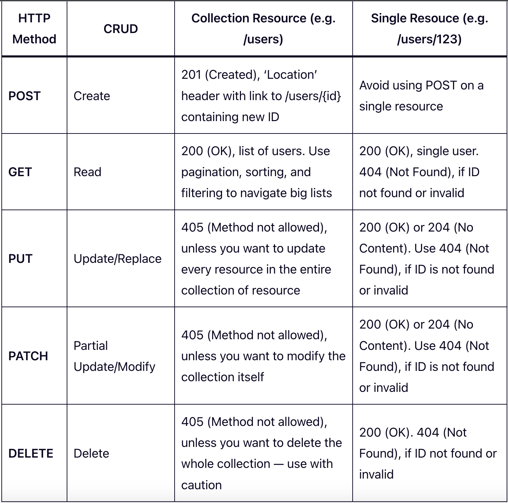

> **Technological terminology**

# A

## API gateway

**API gateway** is an API proxy which is fully managed service. It helps you create APIs and publish, monitor and maintain them. It is scalable, can handle concurrent calls, authorization, traffic management, etc.

# B

## Bearer authentication

**Bearer authentication** is an HTTP authentication scheme that involves security tokens called bearer tokens. The name "Bearer authentication" can be understood as "give access to the bearer of this token". The bearer token is a cryptic string, usually generated by the server in response to a login request. The client must send this token in the Authorization header when making requests to protected resources.

# C

## Cloud computing

**Cloud computing** is the on-demand availability of computer system resources, especially data storage (cloud storage) and computing power, without direct active management by the user. The term is generally used to describe data centers available to many users over the Internet. Large clouds, predominant today, often have functions distributed over multiple locations from central servers.

## CORS

> Cross-Origin Resource Sharing

**CORS** is a mechanism that allows restricted resources on a web page to be requested from another domain outside the domain from which the first resource was served. A web page may freely embed cross-origin images, stylesheets, scripts, iframes, and videos. Certain "cross-domain" requests, notably Ajax requests, are forbidden by default by the same-origin security policy. CORS defines a way in which the browser and the server can interact to determine whether or not to allow the cross-origin request. It is more powerful than only allowing same-origin requests, but it is more secure than simply allowing all such cross-origin requests.

# F

## FaaS

> Function-as-a-Service

**FaaS** is a [cloud computing](#cloud-computing) service model that allows developers to run functions on demand; i.e. a type of [serverless computing](#serverless-computing) where the cloud provider manages the underlying infrastructure and resources. It is often used to run short-lived functions in response to events, known as **serverless functions**.

- [AWS Lambda](/doc/resources.md#aws-lambda)
- [Azure Functions](/doc/resources.md#azure-functions)
- [Google Cloud Functions](/doc/resources.md#google-cloud-functions)

# P

## Proxy

**Proxy** is a server that acts as an intermediary for requests from clients seeking resources from other servers.

# R

## RESTful API

REST defines a consistent and uniform interface for interactions between clients and servers. For example, the **HTTP-based REST APIs** make use of the **standard HTTP methods** (GET, POST, PUT, PATCH, DELETE) and the URIs (Uniform Resource Identifiers) to identify resources. REST APIs are **stateless**, meaning that calls can be made independently of one another, and each call contains all of the data necessary to complete itself successfully.

# S

## SaaS

> Software-as-a-Service

**SaaS** is a cloud computing service model in which the cloud provider hosts applications and makes them available to customers over the internet. SaaS is one of three main categories of cloud computing, alongside Infrastructure-as-a-Service (IaaS) and Platform-as-a-Service (PaaS).

## Serverless computing

**Serverless computing** is a [cloud computing](#cloud-computing) execution model in which the cloud provider runs the server, and dynamically manages the allocation of machine resources. Pricing is based on the actual amount of resources consumed by an application, rather than on pre-purchased units of capacity. It can be a form of utility computing.

# W

## Webhook

**Webhook** are mechanisms for sending real-time data from one application to another whenever a specific event occurs. They are commonly used to send data from a server to a client, but can also be used to send data from a client to a server.

# Z
